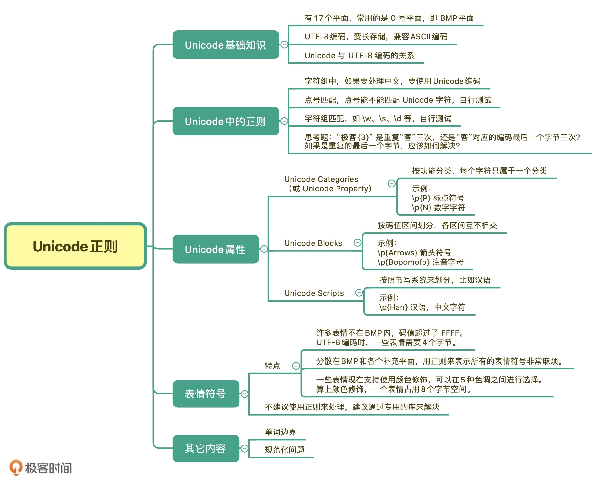

1. Unicode 只规定了字符对应的码值，如果要进行存储或者网络传输等，码值需要编码成字节，常见的编码方式是UTF-8。
2. 在内存中使用的时候可以使用unicode，但是存储到硬盘里时就得转换成字节编码形式。
3. 有些带颜色的emoji表情符号，本质上是图片字符，需要8个字节，表情符号推荐使用专门的包进行处理。
   
   
   python2.7 需要指明`(ur'[时间]', u'极客')`。
   
   在不同的操作系统中会表示为UTF-8编码或者GBK编码。所以才出现了前面的表现。
   
   `?a` 代表一种匹配模式，只匹配 ASCII    
   [python re module](https://docs.python.org/3/library/re.html)    
   (?aiLmsux)    
   (One or more letters from the set 'a', 'i', 'L', 'm', 's', 'u', 'x'.) The group matches the empty string; the letters set the corresponding flags: re.A (ASCII-only matching), re.I (ignore case), re.L (locale dependent), re.M (multi-line), re.S (dot matches all), re.U (Unicode matching), and re.X (verbose), for the entire regular expression. (The flags are described in Module Contents.) This is useful if you wish to include the flags as part of the regular expression, instead of passing a flag argument to the re.compile() function. Flags should be used first in the expression string.
   